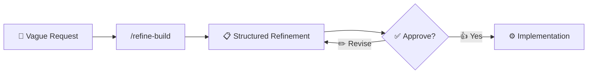

<div align="center">

# PromptForge 🔨

### Turn vague ideas into implementation-ready briefs for AI coding agents


</div>

---

PromptForge is a **local-first requirements compiler** for AI coding agents. It transforms informal developer requests like:

> 💬 *"make me a dashboard for sales with login and charts"*

into structured, implementation-ready engineering prompts with explicit assumptions, scope, acceptance criteria, testing requirements, and an approval gate.

> **Note:** PromptForge does **not** provide another AI model. It uses your host coding agent's model and adds a structured refinement methodology. No hosted backend. No database. No paid API.

---

## 📚 Table of Contents

- [What is PromptForge?](#-what-is-promptforge)
- [Why It Exists](#-why-it-exists)
- [Before / After](#-before--after)
- [Installation](#-installation)
- [Available Commands](#-available-commands)
- [Methodology Profiles](#-methodology-profiles)
- [Output Format](#-output-format)
- [Design Principles](#-design-principles)
- [Privacy](#-privacy)
- [Limitations](#-limitations)
- [Monetization](#-monetization)
- [Roadmap](#-roadmap)
- [Contributing](#-contributing)
- [License](#-license)

---

## 🔍 What is PromptForge?

PromptForge is a methodology and skill system that guides AI coding agents (**Antigravity**, **Claude Code**, **Cursor**) through a structured refinement process before implementation begins.

> **The core idea: refine first, implement second.** ✨

Most developers start implementing immediately when they ask an AI coding agent for help. This leads to rework, misunderstood requirements, and built features that don't match intent.

PromptForge forces a structured requirements phase that:

| Step | Action |
|:---:|---|
| 1️⃣ | Understands the request fully |
| 2️⃣ | Surfaces assumptions explicitly |
| 3️⃣ | Identifies missing decisions |
| 4️⃣ | Defines scope and non-goals |
| 5️⃣ | Creates testable acceptance criteria |
| 6️⃣ | Stops and waits for approval |

Only after explicit `approve` does implementation begin. ✅



---

## ❓ Why It Exists

AI coding agents are powerful — but they need guidance. When you say:

> "add google login"

The agent might:

- ❌ Add OAuth with the wrong scopes
- ❌ Miss account linking for existing users
- ❌ Forget about session management
- ❌ Skip security considerations
- ❌ Start implementing before understanding your existing auth system

PromptForge catches these issues **before** any code is written. 🛡️

---

## 🔁 Before / After

<table>
<tr>
<th>🚫 Before PromptForge</th>
<th>✅ After PromptForge</th>
</tr>
<tr>
<td>

```
You: build a dashboard for sales
Agent: [immediately starts building,
makes dozens of assumptions, builds
features you didn't want, misses
critical requirements]
```

</td>
<td>

```
You: /refine-build build a dashboard
     for sales
Agent: [produces structured refinement:
assumptions, open questions, scope,
non-goals, testable criteria]
"Reply with `approve` to begin."

You: approve
Agent: [implements with full context]
```

</td>
</tr>
</table>

---

## 📦 Installation

### 🤖 Antigravity

```bash
cp -r adapters/antigravity/.agents/skills/ .agents/skills/
```

Or install globally in your Antigravity configuration.

### 🧠 Claude Code

```bash
cp -r adapters/claude-code/.claude/skills/ .claude/skills/
```

Restart Claude Code. Commands like `/refine-build` will be available.

### ⌨️ Cursor

```bash
cp -r adapters/cursor/.cursor/commands/ .cursor/commands/
cp -r adapters/cursor/.cursor/rules/ .cursor/rules/
```

Commands like `/refine-build` will be available in Cursor's command palette.

---

## ⚡ Available Commands

| Command | Purpose |
|---|---|
| `/refine-build` 🏗️ | General software development (default) |
| `/refine-architect` 🧭 | System design and architecture decisions |
| `/refine-security` 🔒 | Security-sensitive features |
| `/refine-performance` 🚀 | Performance optimization |
| `/refine-frontend` 🎨 | User interface and client-side work |
| `/refine-debug` 🐛 | Bug investigation and diagnosis |
| `/refine-product` 📊 | Feature planning and MVP scoping |
| `/refine-backend` 🗄️ | Server-side logic, APIs, data persistence |
| `/refine-audit` 🔍 | Code review, security audit, dependency audit, compliance |
| `/ai-security-audit` 🛡️ | Scan codebase for all vulnerabilities (secrets, auth, injection, XSS, etc.) |
| `/ai-security-fix` 🔧 | Fix vulnerabilities from a security audit report |
| `/refine-testing` 🧪 | Test strategy, coverage planning, QA |
| `/refine-api` 🌐 | API design, REST/GraphQL/gRPC contracts, versioning |
| `/refine-db` 🗃️ | Database-agnostic schema design, migrations, indexing |
| `/refine-mysql` 🐬 | MySQL/MariaDB: InnoDB, indexing, replication, HA |
| `/refine-postgresql` 🐘 | PostgreSQL: JSONB, CTEs, RLS, extensions, partitioning |
| `/refine-mongodb` 🍃 | MongoDB: documents, aggregation, indexing, sharding |

---

## 🧩 Methodology Profiles

Profiles add specialized analysis lenses on top of the base refinement protocol. **They do not replace it — they enhance it.**

| Profile | Focus Areas |
|---|---|
| 🧭 **Architect** | System boundaries, components, data flow, scalability, failure modes, observability |
| 🔒 **Security** | Authentication, authorization, input validation, secrets, privacy, abuse cases, rate limiting |
| 🚀 **Performance** | Latency, throughput, caching, database performance, profiling, benchmarks |
| 🎨 **Frontend** | Component architecture, responsive behavior, accessibility, loading/error/empty states |
| 🗄️ **Backend** | API contracts, service boundaries, validation, persistence, transactions, concurrency |
| 📊 **Product** | User problems, user stories, MVP scope, success metrics, UX edge cases |
| 🐛 **Debug** | Reproduction, root cause analysis, hypotheses, minimal fix, regression testing |
| 🔍 **Audit** | Code quality, OWASP Top 10, dependency CVEs, license compliance, architecture review |
| 🧪 **Testing** | Test pyramid, unit/integration/E2E planning, coverage targets, CI integration |
| 🌐 **API** | REST/GraphQL/gRPC design, versioning, documentation, error format, rate limiting |
| 🗃️ **Database** | Schema design, migrations, indexing, query optimization, data modeling |
| 🐬 **MySQL** | InnoDB optimization, indexing, replication, HA, backup strategy |
| 🐘 **PostgreSQL** | JSONB, CTEs, window functions, partitioning, RLS, extensions |
| 🍃 **MongoDB** | Document design, aggregation pipelines, indexing, sharding, replica sets |

---

## 📄 Output Format

Every refinement produces exactly these sections:

```markdown
# Original Request
# Understanding
# Confirmed Requirements
# Assumptions
# Missing Decisions
# Scope
# Non-Goals
# Repository Context
# Refined Implementation Prompt
  ## Objective
  ## Existing Context
  ## User Stories
  ## Functional Requirements
  ## Technical Constraints
  ## Data Requirements
  ## API Requirements
  ## UI / UX Requirements
  ## Error States
  ## Empty States
  ## Security Requirements
  ## Testing Requirements
  ## Acceptance Criteria
  ## Implementation Phases
  ## Verification Commands
# Quality Review
# Approval
```

---

## 🧭 Design Principles

<details>
<summary><strong>1. 🔍 Assumption Transparency</strong></summary>
<br>
Never silently invent critical requirements. Every assumption is explicitly labeled.
</details>

<details>
<summary><strong>2. 🗂️ Repository Awareness</strong></summary>
<br>
When the request concerns an existing project, PromptForge inspects the codebase and prefers existing patterns, frameworks, and conventions.
</details>

<details>
<summary><strong>3. 🎯 Scope Control</strong></summary>
<br>
Every refinement explicitly defines what IS and IS NOT included.
</details>

<details>
<summary><strong>4. ✅ Verification-First</strong></summary>
<br>
Requirements are testable whenever possible. No vague criteria like "the UI should be user friendly."
</details>

<details>
<summary><strong>5. 🚦 Approval Gate</strong></summary>
<br>
Refinement NEVER silently starts implementation. The developer must explicitly type <code>approve</code>.
</details>

<details>
<summary><strong>6. 🚫 No Fake Personas</strong></summary>
<br>
PromptForge uses engineering methodology profiles (architect, security, performance), not imitation of company employees or private prompting instructions.
</details>

---

## 🔐 Privacy

PromptForge is entirely local. It does **not**:

- ❌ Send requests to any external service
- ❌ Store data in a database
- ❌ Require an API key or paid service
- ❌ Collect telemetry or analytics

The AI reasoning is performed by your existing coding agent. PromptForge provides only the methodology (Markdown files and skill definitions).

---

## ⚠️ Limitations

- **Not an AI model** — PromptForge provides methodology, not intelligence. Output quality depends on your coding agent's capabilities.
- **Not deterministic** — Since refinement uses an LLM, different runs may produce different outputs.
- **Requires a coding agent** — Built for Antigravity, Claude Code, and Cursor. Not a standalone application.
- **No persistence** — Refinements are not stored or versioned (yet).

---

## 🗺️ Roadmap

- [x] **v1.0.0** — 15 commands across 3 platforms, 14 profiles, plugin system, installers
- [ ] **v1.1.0** — Refinement history, prompt export, custom profile tool, community gallery
- [ ] **v1.2.0** — MCP server, real-time collaboration, prompt diff, more IDE integrations
- [ ] **v2.0.0** — Plugin marketplace, team workspaces, CI/CD integration, custom methodology builder

---

## 🤝 Contributing

Contributions are welcome! See [CONTRIBUTING.md](CONTRIBUTING.md) for guidelines.

| Contribution | How |
|---|---|
| 🧩 Add a profile | Create a file in `core/profiles/` + matching skill in each adapter |
| 📘 Add an example | Add a realistic before/after example to `examples/` |
| 🔌 Add an adapter | Create a new adapter directory following existing patterns |
| 🧪 Add a test fixture | Add a fixture to `tests/fixtures/` with validation criteria |
| 🐞 Report issues | Open an issue describing the problem or suggestion |

**Contributor checklist:**

- [ ] Follow existing file structure and naming conventions
- [ ] Use the base protocol as the foundation for new profiles/adapters
- [ ] Add an example demonstrating the new profile or feature
- [ ] Update the README if adding new commands or profiles

---

## 📜 License

MIT — see [LICENSE](LICENSE) for details.

<div align="center">

**Refine first. Implement second.** ⚡

Built with 🔨 by [TonySensei0](https://github.com/TonySensei0) and the PromptForge community

<a href="https://github.com/TonySensei0/promptforge">⭐ Star on GitHub</a> ·
<a href="https://github.com/TonySensei0/promptforge/issues">🐛 Report Bug</a> ·
<a href="https://github.com/TonySensei0/promptforge/discussions">💬 Discussions</a>

</div>
